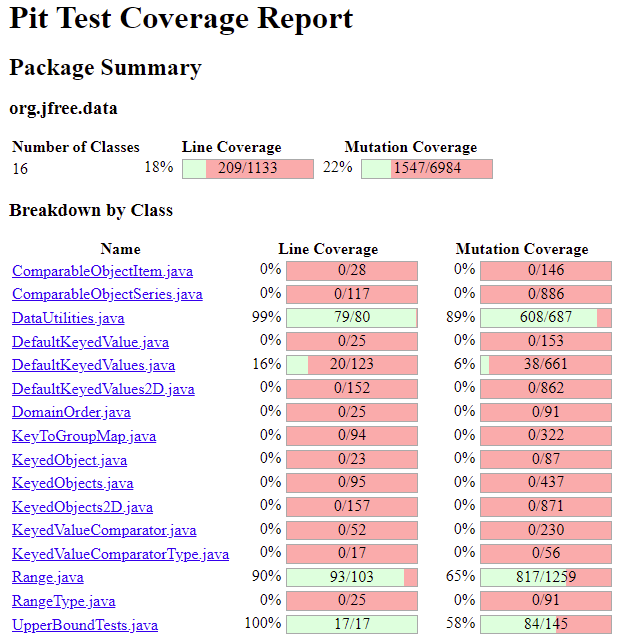
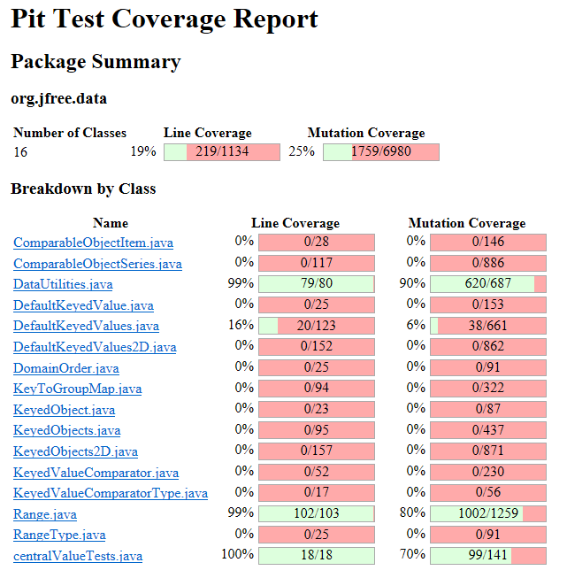

**SENG 438 - Software Testing, Reliability, and Quality**

**Lab. Report \#4 – Mutation Testing and Web app testing**

| Group \#:       | 2  |
|-----------------|---|
| Student Names:  |   |
|     Kyle Hasan            |   |
|       Evyn Rissling          |   |
|           John Abo      |   |
|          Andres Caicedo      |   |

# Introduction

# Analysis of 10 Mutants of the Range class 

| Method            | Mutation                                            | Code Changed to       | How it was killed or not                        |
| ----------------- | --------------------------------------------------- | ------------------------------------------------ | ----------------------------------------------- |
| getCentralValue() | Substituted 2.0 with 1.0                            | return this.lower / 1.0 + this.upper / 2.0| Not covered by original test suite, not killed. |
| getCentralValue() | Substituted 2.0 with 1.0                            | return this.lower / 2.0 + this.upper / 1.0| Not covered by original test suite, not killed. |
| getCentralValue() | Replaced double division with multiplication | return this.lower \* 2.0 + this.upper / 2.0      | Not covered by original test suite, not killed. |
| getCentralValue() | Replaced double division with multiplication        | return this.lower / 2.0 + this.upper \* 2.0      | Not covered by original test suite, not killed. |
| getCentralValue() | replaced double return with 0.0d   | return 0.0d                                      | Not covered by original test suite, not killed. |
| getCentralValue() | Replaced double addition with subtraction    | return this.lower / 2.0 - this.upper / 2.0       | Not covered by original test suite, not killed. |
| getCentralValue() | Replaced double division with modulus        | return this.lower % 2.0 + this.upper / 2.0       | Not covered by original test suite, not killed. |
| getCentralValue() | Replaced double division with modulus       | return this.lower / 2.0 + this.upper % 2.0       | Not covered by original test suite, not killed. |
| getCentralValue() | Replaced double addition with multiplication  | return this.lower / 2.0 \* this.upper / 2.0      | Not covered by original test suite, not killed. |
| getCentralValue() | Replaced double division with addition      | return this.lower + 2.0 + this.upper / 2.0       | Not covered by original test suite, not killed. |

# Report all the statistics and the mutation score for each test class
Note that after observing the current status of the test suite for dataUtilities and attempting to increase the mutation score, we decided to only increase the mutation score by 1%. This is because most of the mutations that survived were very hard or impossible to remove. 

## Before

## After

# Analysis drawn on the effectiveness of each of the test classes

Our mutation score for dataUtilities was much higher than that of the Range class as there were a few methods not covered in the original test suite made tor the Range class, whereas every method in dataUtilities was covered. This meant that each of those methods that were not covered caused every mutant in them to survive. Thus, the Range score was greatly increased by writing additional test cases for the methods originally not covered, while DataUtilities experienced a much smaller increase due to its good mutation score from the beginning.

# A discussion on the effect of equivalent mutants on mutation score accuracy

Equivalent mutants makes the mutation score look lower than what it should be in the sense that the mutation score doesn’t reflect the ratio of mutations the test suite killed to total amount of mutations that can actually be killed. In the mutation score equation mutation score = mutants killed/total mutations, equivalent mutations inflate the number of total mutations. The equivalent mutants have no effect on the behavior of the code, so it’s not possible to kill them since the test cases will run the same with or without their presence, therefore the equivalent mutants make it impossible to reach 100% mutation score and cap it at some value lower than 100% depending on how many equivalent mutants there are. Equivalent mutants could maybe be spotted if their addition has no tangible effect on the observed result. The test tool could also be tweaked to avoid the generation of equivalent mutants in the first place.

# A discussion of what could have been done to improve the mutation score of the test suites

# Why do we need mutation testing? Advantages and disadvantages of mutation testing

Mutation testing helps to show whether the test suite that was made to test a program is “good” or not. In this way, mutation testing shows whether more tests should be added to the test suite to ensure the completeness and coverage of the test suite in many situations. This is its main advantage. A main disadvantage of the mutation testing process was how long the tool took to run. On most of our computers, the tool could take up to 10 minutes to finish the mutation testing. It is also important to note that not every mutation can be tested, as many mutations changed calls to external libraries and changed the booleans from 1 to -1 which are not feasible to test.

# Explain your SELENUIM test case design process

We thought of very common functionalities that most users would use like logging in, signing out, adding an item, and other normal operations. We prioritized these functionalities because these are the main requirements of a site like Walmart which is designed for shopping. Basically, we thought of the most important and common operations that a user might perform.

# Explain the use of assertions and checkpoints

We used assertion and checkpoints to make sure some specific text was on the screen or some element was present to verify the output of our tests. This text was selected based on the likelihood for it to change, as a high likelihood would break the test cases.

# How did you test each functionaity with different test data

Login was tested with an invalid and valid login. Search was tested using 2 different items. The page also was tested for signing out, removing an item from the cart, and checking for an empty cart.

# Discuss advantages and disadvantages of Selenium vs. Sikulix

Selenium was much easier to install and use than sikulix. Sikulix’s image recognition however was more useful in some situations than selenium. Sikulix also didn’t have as many issues with hovers as selenium. Sikulix also works on desktop applications while selenium could not.
# How the team work/effort was divided and managed

For part 1, each member wrote some amount of test cases to improve mutation scores and for part 2, each member tested at least 2 functionalities of the Walmart site using selenium. These functionalities were discussed as a group to ensure minimal overlap occurred.

# Difficulties encountered, challenges overcome, and lessons learned

Many members had issues getting Pitest to work and the Selenium IDE was also quite tricky in regards to hovering over menus, so we had to click on most menus instead during the testing of certain functionalities. Pitest also took a long time to run which made checking the improvement made by a change harder and more tedious.

# Comments/feedback on the lab itself
Pitest made the lab tedious and it was not feasible to increase the DataUtilities score much with how high it was before.
